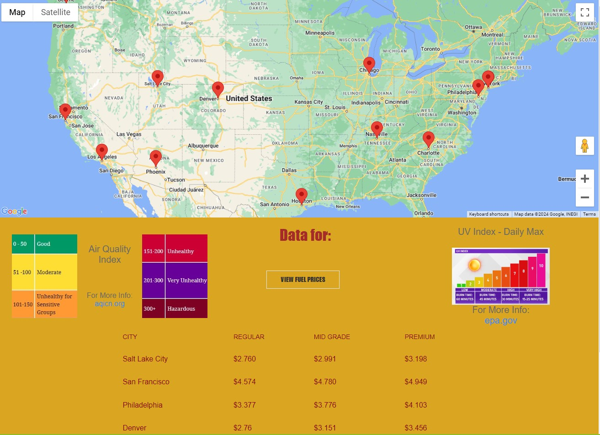
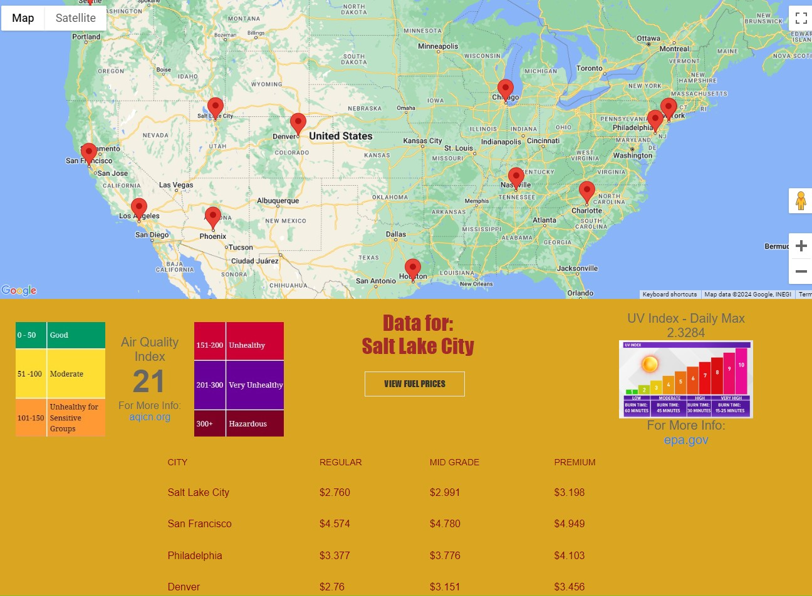
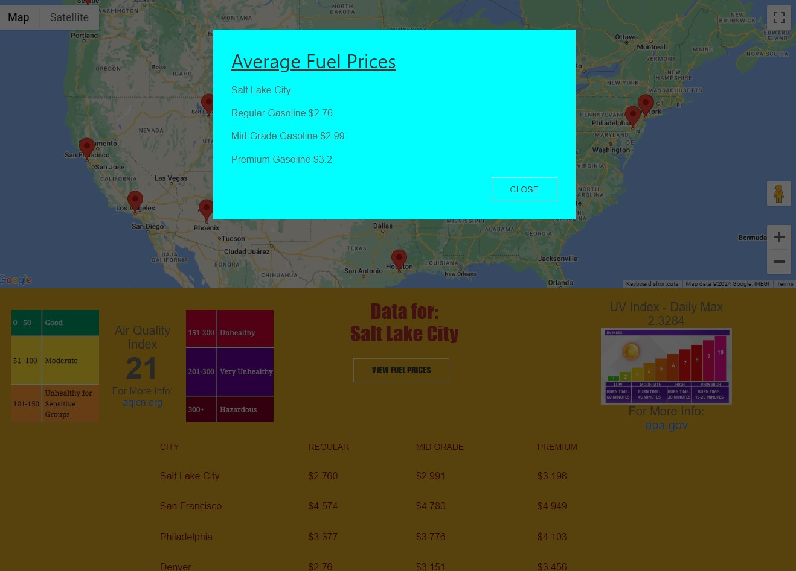

# City Information

## Description

As professional developers, we created a google map that consists of cities that you can visit. We provided informative details about each city such as the air quality, UV index, average gas pricing within selected city, longtitude and latitude. Our motivation for creating this project was to help those that are visiting major cities. The most important thing we learned was how to work as an efficient team and bring about a project that works.

## Installation:
Access this app by navigating to https://carioto.github.io/City-Information/

## Usage:
 
 
 

## Credits
We utilized the uikit and pure frameworks to create many pieces of this app.  
We optained data from the following api's:
 google maps -- map markers
 openuv.io -- UV Index
 collect.api.com -- gas prices
 aqicn.org -- Air Quality Index
 openweathermap.org -- longitude and latitude data

## MIT License

Copyright (c) 2024

Permission is hereby granted, free of charge, to any person obtaining a copy
of this software and associated documentation files (the "Software"), to deal
in the Software without restriction, including without limitation the rights
to use, copy, modify, merge, publish, distribute, sublicense, and/or sell
copies of the Software, and to permit persons to whom the Software is
furnished to do so, subject to the following conditions:

The above copyright notice and this permission notice shall be included in all
copies or substantial portions of the Software.

THE SOFTWARE IS PROVIDED "AS IS", WITHOUT WARRANTY OF ANY KIND, EXPRESS OR
IMPLIED, INCLUDING BUT NOT LIMITED TO THE WARRANTIES OF MERCHANTABILITY,
FITNESS FOR A PARTICULAR PURPOSE AND NONINFRINGEMENT. IN NO EVENT SHALL THE
AUTHORS OR COPYRIGHT HOLDERS BE LIABLE FOR ANY CLAIM, DAMAGES OR OTHER
LIABILITY, WHETHER IN AN ACTION OF CONTRACT, TORT OR OTHERWISE, ARISING FROM,
OUT OF OR IN CONNECTION WITH THE SOFTWARE OR THE USE OR OTHER DEALINGS IN THE
SOFTWARE.
